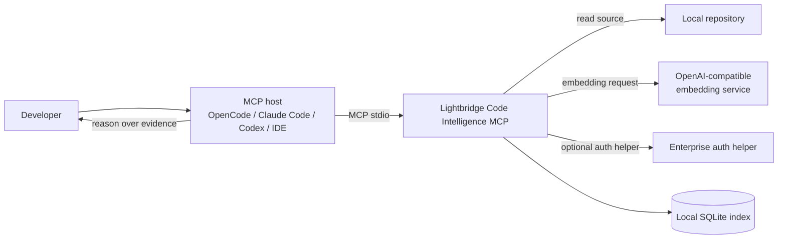
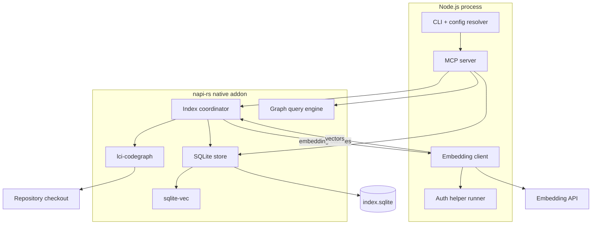
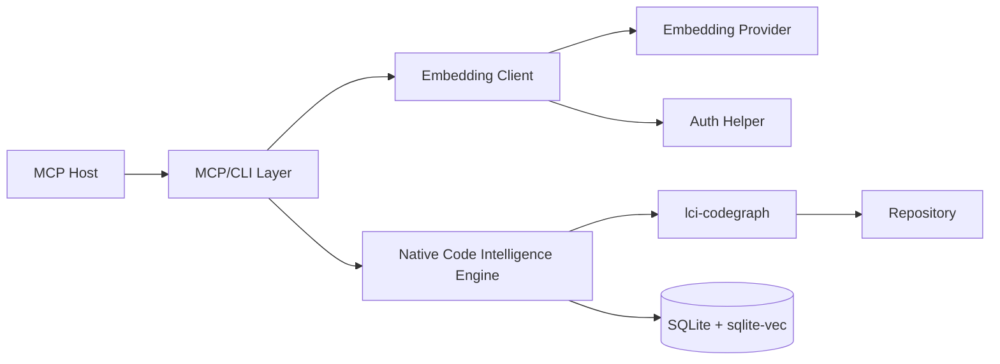
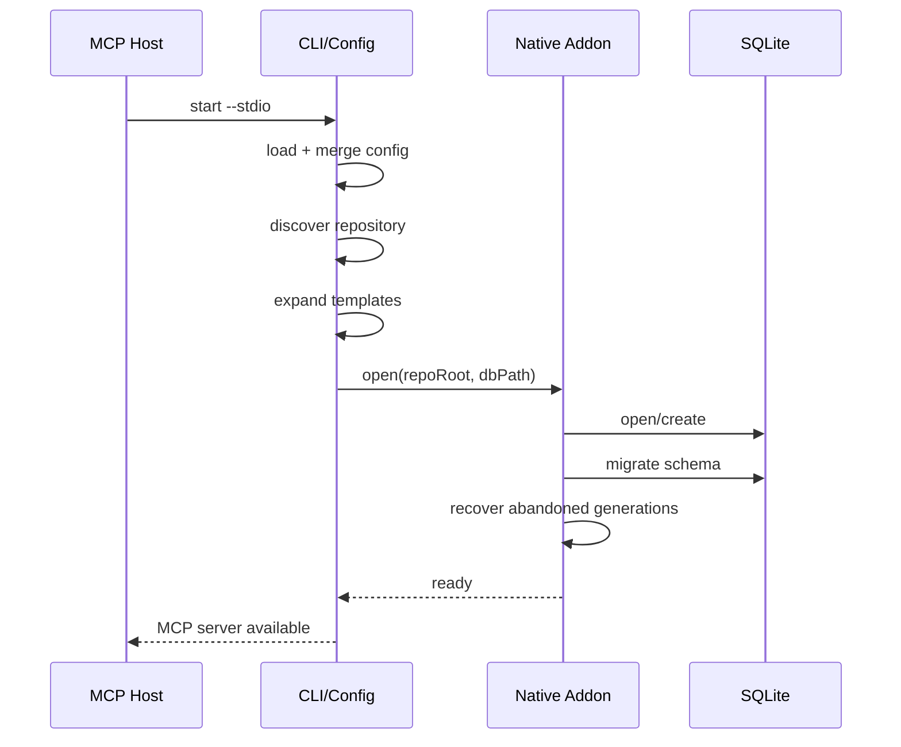
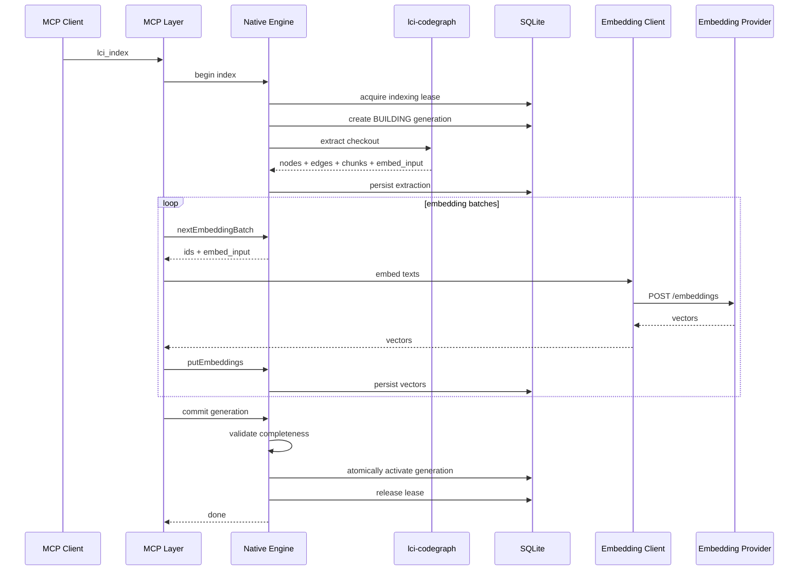
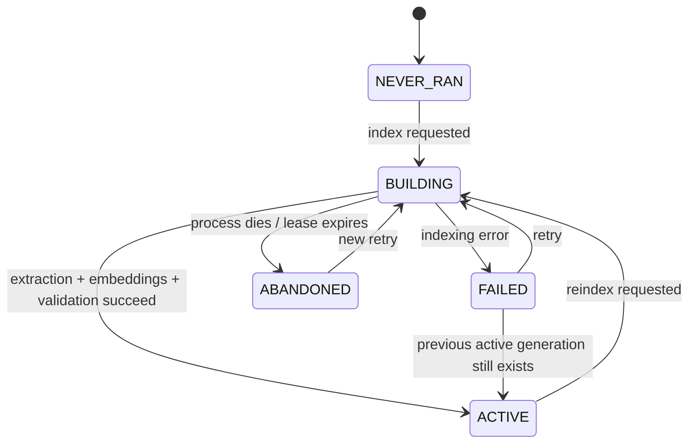
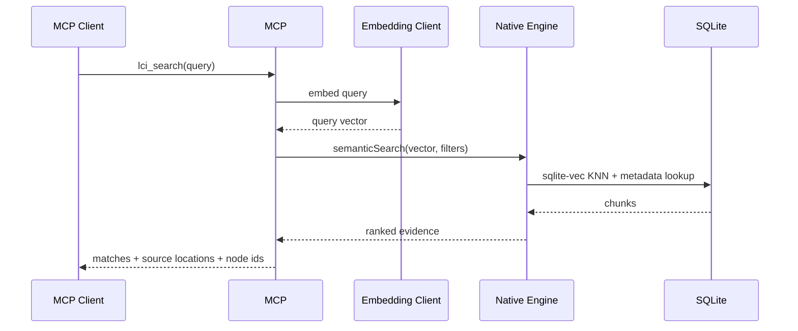
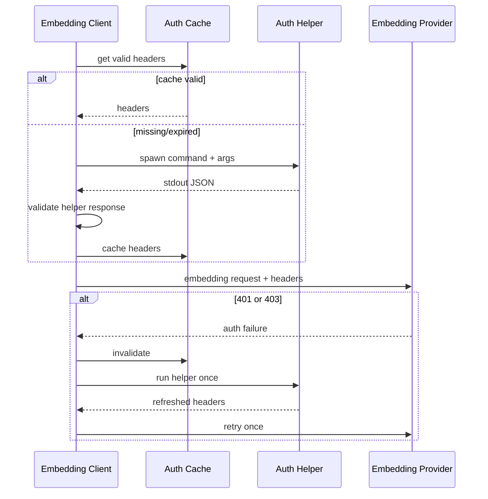
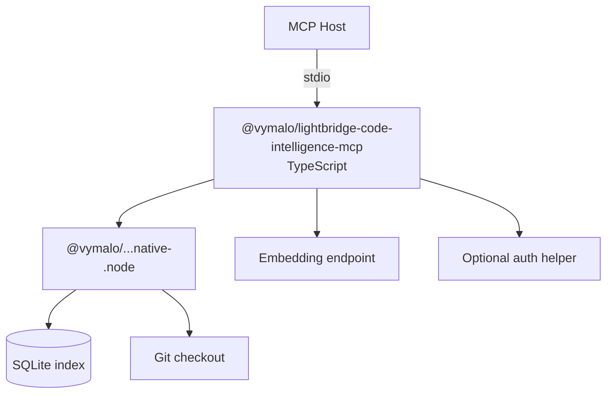

# ARC42 – Lightbridge Code Intelligence MCP

> **Status:** Target architecture for V1  
> **Package:** `@vymalo/lightbridge-code-intelligence-mcp`  
> **Date:** 2026-08-28  
> **Related projects:** `ADORSYS-GIS/lci-codegraph`, `ADORSYS-GIS/lightbridge-code-intelligence`

---

## 1. Introduction and Goals

### 1.1 Purpose

`@vymalo/lightbridge-code-intelligence-mcp` is a local-first Model Context Protocol (MCP) server that gives coding agents repository-aware semantic and structural retrieval.

It is the developer-side counterpart to the repository retrieval capabilities already used by Lightbridge for pull-request intelligence:

- semantic retrieval over code/document chunks;
- structural retrieval over a code graph;
- index lifecycle and freshness tied to repository state;
- deterministic retrieval tools exposed to an external reasoning agent.

The MCP server runs locally in a developer checkout and is expected to be launched by tools such as OpenCode, Claude Code, Codex, IDE integrations, or any other MCP host.

The intended primary invocation is:

```bash
npx @vymalo/lightbridge-code-intelligence-mcp --stdio
```

with optional configuration for the embedding endpoint, authentication, storage location, logging, and indexing behavior.

The product must not contain its own reasoning agent. It provides indexed evidence to the MCP client, which remains responsible for reasoning.

### 1.2 Primary goals

The system shall:

1. Index a local source repository using `lci-codegraph`.
2. Persist semantic chunks, embeddings, graph nodes, graph edges, and index metadata locally.
3. Expose index lifecycle and freshness through MCP.
4. Expose semantic search and graph-oriented code research through MCP.
5. Run as a single local process from the developer's point of view.
6. Require no external database server.
7. Support OpenAI-compatible embedding APIs.
8. Support enterprise authentication through a generic external authentication helper.
9. Support portable configuration from files, inline JSON, and environment variables.
10. Support relocatable database paths through documented `{{template}}` variables.
11. Preserve a usable previous index while a newer index is being built.
12. Be distributed through npm using `napi-rs` platform packages.

### 1.3 Non-goals for V1

V1 is not intended to:

- perform code review itself;
- invoke an LLM to answer the developer's question;
- expose arbitrary SQL to the MCP client;
- expose arbitrary Cypher or another graph-query language;
- require Neo4j, PostgreSQL, pgvector, SurrealDB, or another server;
- replace the hosted Lightbridge control plane;
- implement every possible OAuth2 or enterprise authentication flow internally;
- implement fully incremental per-file indexing initially;
- provide distributed/multi-user index coordination;
- act as a source-control system;
- guarantee graph completeness for dynamic language/runtime behavior that `lci-codegraph` cannot statically resolve.

### 1.4 Stakeholders

| Stakeholder | Need |
|---|---|
| Developer | Fast, local, repository-aware retrieval with minimal setup |
| MCP host | Stable, small, deterministic tool surface |
| Coding agent | High-signal semantic matches and structural relationships |
| `lci-codegraph` maintainer | One extraction model reused by local and hosted products |
| Lightbridge maintainer | Avoid divergence between hosted and local retrieval semantics |
| Enterprise operator | Centralizable embedding endpoint and authentication configuration |
| Package maintainer | Reproducible multi-platform npm releases |
| Security reviewer | No accidental credential leakage or unsafe command/config behavior |

---

## 2. Architecture Constraints

### 2.1 Technology constraints

The following are architectural decisions for V1:

- The public MCP/CLI layer is implemented in TypeScript/Node.js.
- Native indexing and persistence are implemented in Rust.
- Node ↔ Rust integration uses `napi-rs`.
- `lci-codegraph` remains the code/document extraction engine.
- SQLite is the local persistent database.
- `sqlite-vec` provides local vector storage/search.
- SQLite and `sqlite-vec` should be linked into the native addon rather than loaded through an additional Node-native database dependency.
- MCP stdio is the primary initial transport.
- Embeddings are requested from an OpenAI-compatible HTTP API.
- Embedding HTTP, authentication helpers, and remote-service concerns live in TypeScript rather than the Rust indexing core.

### 2.2 Distribution constraints

The package must be installable through normal npm tooling without requiring a local Rust compiler.

The public package is:

```text
@vymalo/lightbridge-code-intelligence-mcp
```

Native binaries are distributed as platform packages selected through `optionalDependencies`.

Illustrative package layout:

```text
@vymalo/lightbridge-code-intelligence-mcp
        |
        +-- @vymalo/lightbridge-code-intelligence-native
                |
                +-- @vymalo/lightbridge-code-intelligence-native-darwin-arm64
                +-- @vymalo/lightbridge-code-intelligence-native-darwin-x64
                +-- @vymalo/lightbridge-code-intelligence-native-linux-x64-gnu
                +-- @vymalo/lightbridge-code-intelligence-native-linux-arm64-gnu
                +-- @vymalo/lightbridge-code-intelligence-native-win32-x64-msvc
                +-- optional additional targets
```

Exact platform package names are an implementation detail and may be shortened, but platform selection must remain invisible to ordinary users.

### 2.3 MCP stdio constraint

When started with `--stdio`:

- process stdin is reserved for MCP input;
- process stdout is reserved for MCP protocol output;
- all application logs go to stderr;
- authentication-helper stdout must be captured and must never be forwarded to the MCP stdout stream.

Reading configuration from stdin is therefore explicitly unsupported in stdio mode.

### 2.4 Compatibility constraint

The local MCP should reuse Lightbridge concepts where practical:

- semantic chunks;
- graph nodes and relations;
- snapshot/freshness metadata;
- semantic search;
- symbol lookup;
- callers/callees;
- stable source locations.

The local implementation may use SQLite instead of Lightbridge's hosted pgvector + Neo4j stores, but this storage difference must not unnecessarily change the user-facing retrieval semantics.

---

## 3. System Scope and Context

### 3.1 Business context



The MCP server is a retrieval subsystem. It does not produce final developer-facing reasoning.

### 3.2 Technical context



### 3.3 External interfaces

#### Repository filesystem

The system reads:

- source files;
- supported documentation;
- `.gitignore`;
- Git metadata;
- current HEAD;
- working-tree state.

`lci-codegraph` owns source interpretation and extraction semantics.

#### Embedding provider

The provider must support an OpenAI-compatible embeddings request/response contract.

Configuration includes at least:

- base URL;
- model;
- optional dimensions where provider/model requires them;
- request timeout;
- batching configuration;
- authentication.

#### Authentication helper

The MCP can execute an external command to obtain HTTP headers for embedding requests.

The helper is a generic enterprise integration boundary and is intentionally not specific to OAuth2.

---

## 4. Solution Strategy

### 4.1 Overall approach

The system combines:

- `lci-codegraph` for source/document extraction;
- SQLite for local persistence and exact relational/graph operations;
- `sqlite-vec` for vector nearest-neighbor search;
- `napi-rs` for a clean Node API;
- TypeScript for MCP, configuration, authentication, and HTTP embedding calls.

### 4.2 Why SQLite rather than a graph server

The current `lci-codegraph` structural model is intentionally small:

- nodes;
- `calls`;
- `contains`;
- `method`.

The primary graph operations are:

- find a symbol;
- find direct callers;
- find direct callees;
- bounded recursive traversal;
- containment lookup.

These operations map efficiently to indexed edge tables and recursive CTEs. A dedicated local graph server would add deployment and operational cost without a demonstrated V1 requirement.

### 4.3 Why semantic and structural retrieval remain separate concepts

Semantic retrieval answers questions such as:

- “Where is behavior similar to authentication validation?”
- “Which code handles account activation?”

Structural retrieval answers questions such as:

- “Who calls this method?”
- “What does this function call?”
- “What type/module contains this symbol?”

The MCP may combine the two in convenience operations, but it must preserve the distinction rather than pretending vector similarity can replace exact graph traversal.

### 4.4 Node/native responsibility boundary

#### TypeScript owns

- CLI argument parsing;
- MCP protocol and tool schemas;
- configuration loading/merging;
- template expansion orchestration;
- embedding HTTP;
- authentication helper execution;
- credential caching;
- logging policy;
- process lifecycle.

#### Rust/native owns

- repository traversal through `lci-codegraph`;
- extraction;
- graph/chunk persistence;
- SQLite connection lifecycle;
- schema migrations;
- vector table interaction;
- graph queries;
- index generations;
- locking and crash recovery;
- repository/index statistics;
- expensive CPU work outside the Node event loop.

### 4.5 N-API data-transfer strategy

Large repository extraction results must not be serialized wholesale into JavaScript.

Bad:

```text
Rust extraction
  -> tens of thousands of JS objects
  -> JS
  -> back into SQLite
```

Preferred:

```text
Rust extraction
  -> SQLite directly

Only embedding batches cross N-API:
  [{ id, embedInput }, ...]
        |
        v
  embedding service
        |
        v
  [{ id, vector }, ...]
        |
        v
  native SQLite/sqlite-vec
```

This minimizes allocations, memory duplication, and V8 pressure.

---

## 5. Building Block View

### 5.1 Level 1



### 5.2 TypeScript building blocks

#### `cli`

Responsibilities:

- parse command-line options;
- choose transport;
- resolve repository root;
- locate and load configuration;
- initialize logging;
- start MCP server.

Expected entry point:

```bash
npx @vymalo/lightbridge-code-intelligence-mcp --stdio
```

#### `config`

Responsibilities:

- built-in defaults;
- global config discovery;
- explicit file config;
- inline config;
- environment config;
- CLI overrides;
- validation;
- template expansion;
- redacted config diagnostics.

#### `mcp`

Responsibilities:

- tool registration;
- input validation;
- stable response schemas;
- conversion between MCP requests and application services;
- mapping expected application errors into model-readable tool errors.

#### `embedding-client`

Responsibilities:

- OpenAI-compatible `/embeddings`;
- batching;
- request timeout;
- transient retry;
- rate-limit handling;
- authentication integration;
- vector-dimension validation.

#### `auth-helper`

Responsibilities:

- execute a configured process without implicit shell expansion;
- capture stdout;
- parse JSON;
- capture/log stderr safely;
- timeout/kill hung helpers;
- cache headers;
- invalidate cache after authentication failures.

### 5.3 Native building blocks

#### `RepositoryInspector`

Provides:

- canonical repository root;
- Git HEAD;
- dirty state;
- repository identity inputs;
- repository key.

#### `IndexCoordinator`

Owns:

- start index generation;
- invoke `lci-codegraph`;
- persist chunks/nodes/edges;
- expose embedding batches;
- accept embedding vectors;
- validate generation completeness;
- atomically activate completed generation;
- fail/abandon incomplete generations.

#### `CodeGraphExtractor`

Thin integration around `lci-codegraph`.

It must not fork a separate extraction semantics for local MCP.

#### `SqliteStore`

Owns:

- schema;
- migrations;
- transactions;
- index metadata;
- chunks;
- graph nodes;
- graph edges;
- vector rows;
- process coordination records.

#### `GraphQueryService`

Provides:

- symbol lookup;
- callers;
- callees;
- containment;
- bounded traversal;
- symbol exploration.

#### `SemanticSearchService`

Provides vector nearest-neighbor retrieval with metadata filters and deterministic response shaping.

#### `IndexLock`

Coordinates concurrent MCP processes pointing at the same database.

### 5.4 Public native API

The exact napi-rs API may evolve, but the desired abstraction is high-level.

Illustrative TypeScript view:

```ts
interface OpenIndexOptions {
  repository: string;
  database: string;
}

interface StartIndexOptions {
  headSha: string;
  extractorFingerprint: string;
  embeddingFingerprint: string;
}

interface EmbeddingBatchItem {
  id: number;
  text: string;
}

interface EmbeddingResult {
  id: number;
  vector: Float32Array;
}

class CodeIndex {
  static open(options: OpenIndexOptions): Promise<CodeIndex>;

  status(): Promise<IndexStatus>;

  beginIndex(options: StartIndexOptions): Promise<IndexGeneration>;
  nextEmbeddingBatch(generationId: string, limit: number):
    Promise<EmbeddingBatchItem[]>;
  putEmbeddings(generationId: string, values: EmbeddingResult[]):
    Promise<void>;
  commitIndex(generationId: string): Promise<void>;
  failIndex(generationId: string, reason: string): Promise<void>;

  search(input: SearchInput): Promise<SearchResult>;
  findSymbol(input: FindSymbolInput): Promise<SymbolResult>;
  callers(input: TraversalInput): Promise<GraphResult>;
  callees(input: TraversalInput): Promise<GraphResult>;
  exploreSymbol(input: ExploreSymbolInput): Promise<ExploreResult>;
}
```

Native calls performing filesystem, parsing, traversal, migration, or substantial SQLite work must be asynchronous from Node's perspective and must not block the JavaScript event loop.

---

## 6. Runtime View

### 6.1 Startup



Startup should not automatically perform a potentially expensive full index unless auto-indexing is explicitly configured.

### 6.2 Indexing flow



Whether `lci_index` itself waits for completion or starts an in-process job and returns immediately is an API-level decision still to be finalized. The underlying index-generation model must support status observation either way.

No work may be promised after the owning MCP process has terminated.

### 6.3 Index generation state machine



`FAILED` is metadata about the latest attempted generation. It does not imply that no usable index exists.

### 6.4 Search flow



### 6.5 Semantic-to-structural research flow

A typical agent interaction is:

```text
lci_search("where is JWT validation performed?")
        |
        v
semantic result with nodeId
        |
        v
lci_explore_symbol(nodeId)
        |
        +--> container
        +--> callers
        +--> callees
        +--> nearby structural context
```

This is a primary value proposition of the system.

### 6.6 Authentication helper flow



Authentication retry is bounded to avoid loops.

### 6.7 Concurrent process behavior

Example:

```text
OpenCode --------\
                  \
Claude Code -------> same index.sqlite
                  /
IDE agent --------/
```

Only one process may own the indexing lease at a time.

Other processes:

- may continue reading the currently active generation;
- may observe the in-progress generation;
- must not start a competing generation while a valid lease exists;
- may recover/take over only after the prior lease is considered abandoned.

SQLite's own locking is not sufficient as the complete product-level lifecycle contract; the application must represent indexing ownership explicitly.

---

## 7. Deployment View

### 7.1 Developer machine



No local database daemon is required.

### 7.2 Native npm release

Release ordering should prevent a root package from referencing unpublished binaries:

1. build and test all native targets;
2. publish every platform package;
3. verify expected platform package versions exist;
4. publish the native umbrella package if one is used;
5. publish `@vymalo/lightbridge-code-intelligence-mcp`.

Root/umbrella dependencies should use exact compatible versions.

### 7.3 Initial platform matrix

Recommended initial targets:

- macOS arm64;
- macOS x64;
- Linux x64 glibc;
- Linux arm64 glibc;
- Windows x64 MSVC.

musl/Alpine should be added when there is a demonstrated requirement rather than automatically multiplying the V1 release matrix.

---

## 8. Cross-Cutting Concepts

### 8.1 Configuration

One configuration object must have identical semantics regardless of source.

Supported sources:

```bash
# File
lci-mcp --config ~/.config/lci/config.json

# Explicit inline JSON
lci-mcp --config-json '{"embedding":{...}}'

# Environment / host integration
LCI_CONFIG_CONTENT='{"embedding":{...}}' lci-mcp --stdio
```

The environment form is important for MCP hosts and organization-provided well-known configuration.

#### Configuration precedence

From lowest to highest priority:

```text
built-in defaults
    ↓
discovered global/default config
    ↓
--config <file>
    ↓
LCI_CONFIG_CONTENT
    ↓
--config-json <json>
    ↓
individual CLI flags
```

The exact behavior of an optional repository-local config file must be documented before V1 if included.

#### Merge semantics

Objects are deep-merged.

Arrays must not silently use ambiguous merge behavior. Each array-valued property must document whether it:

- replaces the previous array; or
- has an explicit additive companion property.

V1 should prefer replacement semantics unless there is a strong reason otherwise.

#### Public schema

The configuration JSON Schema is part of the public compatibility contract.

A future schema URL may be published for editor autocomplete and validation.

### 8.2 Example configuration

```json
{
  "embedding": {
    "baseUrl": "https://ai.example.com/v1",
    "model": "qwen3-embedding-8b",
    "requestTimeoutMs": 30000,
    "batchSize": 64,

    "auth": {
      "helper": {
        "command": "company-auth",
        "args": ["headers", "--service", "embeddings"],
        "timeoutMs": 10000,
        "cacheTtlSeconds": 300
      }
    }
  },

  "storage": {
    "database": "{{repoRoot}}/.lci/index.sqlite"
  },

  "index": {
    "autoIndex": false
  },

  "logging": {
    "level": "info"
  }
}
```

### 8.3 Authentication helper contract

Preferred configuration:

```json
{
  "embedding": {
    "auth": {
      "helper": {
        "command": "company-auth",
        "args": ["embedding-headers"]
      }
    }
  }
}
```

The MCP server does not implicitly invoke a shell.

Users who need shell syntax may explicitly configure:

```json
{
  "command": "bash",
  "args": [
    "-lc",
    "company-auth token | company-auth make-headers"
  ]
}
```

#### Minimal helper stdout

```json
{
  "Authorization": "Bearer eyJ..."
}
```

#### Extended helper stdout

```json
{
  "headers": {
    "Authorization": "Bearer eyJ...",
    "X-Company-Tenant": "engineering"
  },
  "expiresAt": "2026-08-28T12:00:00Z"
}
```

Rules:

- stdout must contain exactly one JSON value;
- header names and values must be strings;
- helper stderr may be captured for diagnostics but must not be treated as credentials;
- helper stdout must never be logged;
- helper output size is bounded;
- helper execution has a timeout;
- non-zero exit is an authentication failure;
- malformed JSON is an authentication failure;
- cached credentials are refreshed before/at expiration;
- a provider 401/403 invalidates cached credentials and triggers at most one refresh + retry;
- static configured headers and helper headers require documented conflict precedence;
- secret values are redacted from diagnostics.

### 8.4 Storage path templating

The database path supports a deliberately small template language.

Initial variables:

```text
{{repoRoot}}
{{repoName}}
{{repoKey}}
{{headSha}}
{{shortHeadSha}}
{{homeDir}}
{{tmpDir}}
```

Example default:

```json
{
  "storage": {
    "database": "{{repoRoot}}/.lci/index.sqlite"
  }
}
```

Example shared cache location:

```json
{
  "storage": {
    "database": "{{tmpDir}}/lci-mcp/{{repoKey}}/index.sqlite"
  }
}
```

Example per-commit index location:

```json
{
  "storage": {
    "database": "{{tmpDir}}/lci-mcp/{{repoKey}}/{{shortHeadSha}}.sqlite"
  }
}
```

Per-commit databases are supported but are not recommended as the normal default because filesystem garbage collection becomes the user's responsibility.

Unknown template variables are configuration errors. They must not silently remain unresolved.

### 8.5 Repository identity

`repoKey` must be stable across ordinary restarts and should avoid accidental collisions.

Target algorithm:

1. canonicalize repository root;
2. normalize a canonical Git remote identity when one is available;
3. derive repository identity from a documented combination of remote identity and/or canonical root;
4. hash the identity;
5. expose a stable shortened hash as `repoKey`.

The exact canonicalization algorithm must be fixed before V1 because changing it changes default database locations.

Required edge cases:

- repository with no remote;
- two clones of the same remote;
- Git worktrees;
- renamed checkout directory;
- URL forms such as SSH vs HTTPS for the same remote.

### 8.6 Index identity and freshness

Freshness is not defined by HEAD alone.

Conceptually:

```text
fresh =
    indexedHeadSha == currentHeadSha
    AND relevantWorkingTreeStateIsCompatible
    AND schemaVersion == currentSchemaVersion
    AND extractorFingerprint == currentExtractorFingerprint
    AND embeddingFingerprint == currentEmbeddingFingerprint
```

The embedding fingerprint includes at least:

- model;
- dimensions;
- relevant embedding-input configuration;
- normalization behavior if applicable.

The extractor fingerprint includes at least:

- schema version;
- `lci-codegraph`/native extraction version;
- chunking-affecting settings.

Example status:

```json
{
  "state": "done",
  "usable": true,
  "stale": true,
  "staleReasons": [
    "working_tree_dirty",
    "embedding_model_changed"
  ],
  "revision": {
    "indexedHeadSha": "abc123",
    "currentHeadSha": "abc123",
    "dirty": true
  }
}
```

### 8.7 Dirty working tree

Local developer state differs from hosted commit-snapshot indexing.

V1 must at minimum detect relevant working-tree changes and report them as a freshness condition.

A later release may calculate a deterministic working-tree fingerprint and index dirty content explicitly.

Until then, the system must not claim an index is fully fresh solely because HEAD matches.

### 8.8 Database generations

A reindex does not overwrite the active index in place.

Conceptual state:

```text
generation 41   ACTIVE
generation 42   BUILDING
```

After successful completion:

```text
generation 41   OBSOLETE
generation 42   ACTIVE
```

On failure:

```text
generation 41   ACTIVE
generation 42   FAILED
```

This guarantees that indexing failure does not destroy the last usable retrieval snapshot.

### 8.9 SQLite schema

The exact DDL belongs in implementation/migrations, but the logical schema is:

```text
schema_metadata
repository_metadata
index_generations
index_lease

files
chunks
chunk_vectors

graph_nodes
graph_edges
```

#### Graph nodes

Minimum fields:

```text
generation_id
node_id
label
source_file
start_line
```

#### Graph edges

Minimum fields:

```text
generation_id
source
target
relation
```

Required indexes include:

```text
(source, relation)
(target, relation)
```

#### Chunks

Minimum fields:

```text
id
generation_id
file_path
language
chunk_type
symbol_name
node_id
start_line
end_line
content
embed_input
content_hash
```

Vector storage is associated with chunk identity within a generation.

### 8.10 Schema migration

The database records a schema version.

On startup the native addon must choose one of:

- migrate in place;
- determine that the database can be rebuilt;
- refuse with a clear incompatibility message.

Old indexes will outlive npm upgrades, so migration/rebuild behavior is a required V1 concern rather than a later optimization.

### 8.11 Search semantics

V1 semantic search is primarily vector KNN over chunks.

Supported filters should include at least:

- path/path prefix;
- language;
- optional chunk/symbol type where practical.

Each match should contain:

```json
{
  "chunkId": 829,
  "nodeId": "src/auth/token.ts#81:verifyToken",
  "symbol": "verifyToken()",
  "file": "src/auth/token.ts",
  "startLine": 81,
  "endLine": 114,
  "score": 0.873,
  "content": "..."
}
```

The exact meaning/range of `score` must be documented. If the underlying metric uses distance, the API must not mislabel distance as probability.

Future retrieval may add:

- exact symbol/path boosts;
- lexical retrieval;
- graph expansion;
- reranking.

These enhancements must preserve understandable result provenance.

### 8.12 Graph traversal

All graph traversal is bounded.

Inputs include:

- node id;
- depth;
- result limit.

Hard caps are enforced independently of client values.

Traversal must:

- handle cycles;
- produce deterministic results;
- avoid unbounded recursive CTE execution;
- distinguish `calls`, `contains`, and `method` where relevant.

### 8.13 Logging and diagnostics

Under stdio:

- stdout: MCP only;
- stderr: logs only.

Configuration supports:

```text
--log-level error|warn|info|debug|trace
```

Secrets must never be logged, including:

- helper stdout;
- authorization headers;
- API keys;
- bearer tokens.

A diagnostic command should expose resolved, non-secret configuration:

```bash
npx @vymalo/lightbridge-code-intelligence-mcp config show
```

Example output:

```json
{
  "repository": {
    "root": "/work/project",
    "name": "project",
    "repoKey": "ca140fa3750dc352",
    "headSha": "03f4dec9"
  },
  "embedding": {
    "baseUrl": "https://ai.example.com/v1",
    "model": "qwen3-embedding-8b",
    "auth": {
      "type": "helper",
      "command": "company-auth"
    }
  },
  "storage": {
    "template": "{{tmpDir}}/lci-mcp/{{repoKey}}/index.sqlite",
    "resolved": "/tmp/lci-mcp/ca140fa3750dc352/index.sqlite"
  }
}
```

### 8.14 Security and untrusted input

Repositories and their files are untrusted input.

Required protections include:

- retain `lci-codegraph` file/input size limits;
- bound PDF/document parsing where applicable;
- bound helper output;
- bound helper execution time;
- bound embedding request sizes;
- bound graph depth and result count;
- bound MCP response sizes;
- validate database path after template expansion;
- no implicit shell evaluation;
- no secrets in CLI flags by default where environment/config references can be used;
- no auth data in logs;
- use parameterized SQL;
- maintain SQLite schema migration integrity.

---

## 9. Architecture Decisions

### ADR-LCI-MCP-001 – Use napi-rs

**Decision:** Node integrates with the Rust indexing core through `napi-rs`.

**Rationale:**

- clean single-process experience;
- reuse Rust extraction code directly;
- avoid subprocess protocol/version management;
- npm platform-package distribution is acceptable;
- native work can own SQLite without exposing it to JS.

### ADR-LCI-MCP-002 – SQLite + sqlite-vec for local persistence

**Decision:** Use bundled SQLite and `sqlite-vec` inside the native addon.

**Rationale:**

- one local file;
- no daemon;
- graph operations are simple enough for indexed edge tables;
- vector search and metadata are colocated;
- avoids installing Neo4j + pgvector locally.

### ADR-LCI-MCP-003 – Keep remote embedding/auth in TypeScript

**Decision:** Rust produces embedding inputs; TypeScript performs remote embedding requests.

**Rationale:**

- OAuth/auth/proxy/service integration belongs near the Node integration layer;
- avoids adding a remote-auth HTTP stack to each native binary;
- enterprise auth is easier to extend;
- embedding provider failures remain clearly separated from extraction/storage.

### ADR-LCI-MCP-004 – Generic auth helper

**Decision:** Support an external helper that returns HTTP headers as JSON.

**Rationale:**

- avoids implementing every enterprise identity system;
- supports OAuth2, cloud CLIs, kubectl-backed auth, internal tools, and custom brokers;
- gives organizations control over credential acquisition.

### ADR-LCI-MCP-005 – Generation-based indexing

**Decision:** Build new generations separately and atomically activate only complete indexes.

**Rationale:**

- search remains usable during reindex;
- embedding/provider failure does not destroy the last good index;
- crash recovery is explicit.

### ADR-LCI-MCP-006 – Portable config object

**Decision:** A single configuration model is accepted through file, inline JSON, or environment.

**Rationale:**

- works for human CLI use;
- works in MCP-host configuration;
- works in organization-provided well-known configurations;
- avoids maintaining multiple semantics for the same setting.

### ADR-LCI-MCP-007 – Templated storage paths

**Decision:** Database locations may contain a small documented set of `{{variables}}`.

**Rationale:**

- repository-local DB is useful by default;
- some developers/organizations prefer cache/temp storage;
- MCP hosts may launch from different environments.

### ADR-LCI-MCP-008 – Keep MCP tool surface semantic

**Decision:** Expose purpose-built code-intelligence tools rather than raw SQLite/graph-query access.

**Rationale:**

- stable contract independent of storage engine;
- safer bounded queries;
- easier for models;
- potential future hosted backend compatibility.

---

## 10. Quality Requirements

### 10.1 Quality tree

```text
Quality
├── Usability
│   ├── one-command startup
│   ├── no local DB daemon
│   └── useful diagnostics
├── Reliability
│   ├── previous index survives failed rebuild
│   ├── crash recovery
│   └── concurrent readers
├── Performance
│   ├── native extraction
│   ├── batched embeddings
│   └── bounded retrieval
├── Portability
│   ├── npm platform packages
│   ├── configurable DB location
│   └── portable config object
├── Security
│   ├── no leaked auth headers
│   ├── bounded untrusted input
│   └── explicit helper execution
└── Maintainability
    ├── reuse lci-codegraph
    ├── storage hidden behind native API
    └── stable MCP contract
```

### 10.2 Quality scenarios

| ID | Scenario | Expected behavior |
|---|---|---|
| Q1 | Embedding API fails halfway through reindex | Previous active index remains queryable; attempt is marked failed |
| Q2 | Process crashes during indexing | Next process identifies abandoned generation and recovers without corrupting active index |
| Q3 | OpenCode and another MCP client start simultaneously | One may index; both may read active generation; no duplicate competing rebuild |
| Q4 | Developer changes embedding model | Existing index is reported stale due to embedding fingerprint mismatch |
| Q5 | Developer has uncommitted edits | Status does not falsely report repository knowledge as fully fresh |
| Q6 | Auth helper returns invalid JSON | Embedding operation fails with actionable error; no malformed headers are sent |
| Q7 | Auth helper writes diagnostics to stderr | Diagnostics do not corrupt MCP protocol |
| Q8 | Very large graph traversal is requested | Hard limits prevent runaway query/result size |
| Q9 | npm package runs on supported clean machine | No Rust compiler, SQLite package, or DB daemon is required |
| Q10 | Config is delivered via MCP-host environment | It behaves identically to the same JSON loaded from a file |
| Q11 | Database schema changes after upgrade | Native addon migrates or clearly requests rebuild; it does not silently misread old data |
| Q12 | Search returns a structured chunk | Result exposes `nodeId`, allowing direct follow-up graph exploration |

---

## 11. Risks and Technical Debt

### 11.1 sqlite-vec maturity

`sqlite-vec` is comparatively young and may introduce compatibility changes.

Mitigation:

- pin versions;
- wrap vector operations behind `SemanticSearchService`;
- persist enough metadata to rebuild the index;
- do not expose sqlite-vec-specific SQL through public APIs.

### 11.2 Native release matrix

Every supported OS/CPU/libc target increases CI and release complexity.

Mitigation:

- deliberately small V1 matrix;
- test artifacts before publication;
- publish platform packages before the public package;
- exact dependency versions.

### 11.3 Working-tree freshness

HEAD alone is insufficient, while a complete dirty-tree snapshot/fingerprint model increases complexity.

V1 requirement:

- detect dirty state;
- report appropriate staleness.

Potential later improvement:

- per-file content hashes;
- working-tree fingerprint;
- selective dirty-file reindex.

### 11.4 Incremental indexing

A full repository reindex may become expensive for large monorepos.

Potential evolution:

- content-hash reuse;
- changed-file extraction;
- generation layering;
- dependency-aware re-extraction.

V1 architecture must avoid choices that make incremental indexing impossible later.

### 11.5 Graph precision

Static graph extraction cannot perfectly resolve all dynamic calls, reflection, generated code, aliases, or framework behavior.

Mitigation:

- continue improving `lci-codegraph`;
- keep semantic retrieval as complementary evidence;
- do not present graph edges as runtime execution proof.

### 11.6 Repository-key canonicalization

Changing the `repoKey` algorithm after release may cause users to silently get a new default cache/database location.

Mitigation:

- specify and test the algorithm before V1;
- surface resolved DB path in status/diagnostics.

### 11.7 Cross-process lease recovery

Incorrect lease timing could either allow duplicate indexing or leave a repository apparently stuck.

Mitigation:

- owner token + process metadata;
- heartbeat/lease expiry;
- conservative takeover;
- SQLite transaction around ownership changes;
- explicit abandoned-generation recovery tests.

### 11.8 Embedding provider compatibility

“OpenAI-compatible” providers vary in authentication, limits, dimensions, and error behavior.

Mitigation:

- narrow supported request/response subset;
- configurable headers/auth helper;
- explicit dimension validation;
- actionable errors;
- bounded retries.

---

## 12. Glossary

| Term | Meaning |
|---|---|
| **LCI** | Lightbridge Code Intelligence |
| **MCP** | Model Context Protocol |
| **MCP host** | Client application that launches/connects to the MCP server |
| **`lci-codegraph`** | Rust extractor producing semantic chunks and a structural code graph |
| **Chunk** | Embeddable source/document unit with source metadata |
| **`embed_input`** | Graph-aware text representation prepared for embedding |
| **Node** | Structural code-graph entity such as a file or definition |
| **Edge** | Structural relation such as `calls`, `contains`, or `method` |
| **Generation** | Complete candidate index snapshot stored separately until activated |
| **Active generation** | Generation currently used for retrieval |
| **Embedding fingerprint** | Identity of model/dimensions/relevant semantic-index configuration |
| **Extractor fingerprint** | Identity of schema/extractor/chunking configuration |
| **`repoKey`** | Stable hash-based identifier used for repository-specific storage templates |
| **Auth helper** | External command returning embedding-request HTTP headers |
| **Stale** | Index is usable but does not fully match current repository/config state |
| **Usable** | A complete active generation exists and may serve retrieval |

---

# Appendix A – Proposed MCP V1 Surface

The V1 MCP surface should remain deliberately small.

## `lci_index`

Indexes/reindexes the current repository.

Possible input:

```json
{
  "force": false
}
```

Expected behavior:

- reject or coalesce if another valid indexing lease exists;
- capture target repository state;
- build a new generation;
- never destroy the prior active generation on failure.

The exact synchronous vs started/status-based return behavior must be fixed in the MCP API specification.

## `lci_index_status`

Returns index lifecycle, freshness, configuration identity, and statistics.

Example:

```json
{
  "state": "done",
  "usable": true,
  "stale": false,
  "staleReasons": [],

  "repository": {
    "root": "/work/project",
    "repoKey": "ca140fa3750dc352"
  },

  "database": {
    "path": "/work/project/.lci/index.sqlite"
  },

  "revision": {
    "indexedHeadSha": "a39fcd...",
    "currentHeadSha": "a39fcd...",
    "dirty": false
  },

  "embedding": {
    "model": "qwen3-embedding-8b",
    "dimensions": 4096
  },

  "stats": {
    "files": 481,
    "chunks": 2931,
    "nodes": 1584,
    "edges": 4291
  }
}
```

Status state vocabulary:

```text
never_ran
in_progress
done
failed
```

Internal native states such as `ABANDONED` may be represented as failure/recovery metadata rather than expanding the public MCP enum unless a client use case requires it.

## `lci_search`

Semantic code/document search.

Input:

```json
{
  "query": "where is JWT validation performed?",
  "limit": 10,
  "path": "src/",
  "language": "typescript"
}
```

Returns evidence, not a generated answer.

## `lci_find_symbol`

Finds structural symbols by name/label/path context.

Input:

```json
{
  "term": "verifyToken",
  "limit": 20
}
```

## `lci_get_callers`

Returns bounded reverse call relationships.

Input:

```json
{
  "nodeId": "src/auth/token.ts#81:verifyToken",
  "depth": 1,
  "limit": 50
}
```

## `lci_get_callees`

Returns bounded forward call relationships.

Input is analogous to `lci_get_callers`.

## `lci_explore_symbol`

Convenience retrieval combining a symbol with its immediate structural neighborhood.

Input:

```json
{
  "nodeId": "src/auth/token.ts#81:verifyToken",
  "callersDepth": 1,
  "calleesDepth": 1,
  "limit": 50
}
```

Expected result may include:

- symbol;
- containing symbols;
- callers;
- callees;
- source location;
- optionally associated semantic chunk.

This tool is expected to reduce multi-round MCP calls for common developer investigations.

---

# Appendix B – Proposed CLI Surface

```text
lightbridge-code-intelligence-mcp --stdio

Configuration:
  --config <path>
  --config-json <json>

Embedding:
  --embedding-base-url <url>
  --embedding-model <model>
  --embedding-dimensions <n>

Storage:
  --database <template-or-path>

Runtime:
  --root <path>
  --log-level <level>
```

Secret-bearing direct CLI options should be avoided where possible.

Environment:

```text
LCI_CONFIG_CONTENT
```

Additional environment variables may be added for secret indirection, but the generic auth helper is the preferred enterprise escape hatch.

---

# Appendix C – Example OpenCode-style Inline Configuration

Illustrative host configuration:

```json
{
  "mcp": {
    "lightbridge-code-intelligence": {
      "type": "local",
      "command": [
        "npx",
        "-y",
        "@vymalo/lightbridge-code-intelligence-mcp",
        "--stdio"
      ],
      "environment": {
        "LCI_CONFIG_CONTENT": "{\"embedding\":{\"baseUrl\":\"https://ai.company.internal/v1\",\"model\":\"qwen3-embedding-8b\",\"auth\":{\"helper\":{\"command\":\"company-auth\",\"args\":[\"headers\",\"--service\",\"embeddings\"]}}},\"storage\":{\"database\":\"{{tmpDir}}/lci-mcp/{{repoKey}}/index.sqlite\"}}"
      }
    }
  }
}
```

The MCP package must not depend on OpenCode-specific behavior; this is only one configuration carrier for the portable LCI config object.

---

# Appendix D – Related Architecture

This project deliberately reuses concepts from:

- `https://github.com/ADORSYS-GIS/lci-codegraph`
- `https://github.com/ADORSYS-GIS/lightbridge-code-intelligence`
- Lightbridge ADR-0020: MCP retrieval clients and semantic/graph tool boundaries
- Lightbridge ADR-0086: in-house `lci-codegraph` extraction
- Lightbridge RFC-0002: indexed snapshot/layer lifecycle concepts

The local MCP is not required to copy Lightbridge's hosted storage architecture. Its objective is to preserve compatible code-intelligence semantics while using an embedded developer-friendly implementation.
