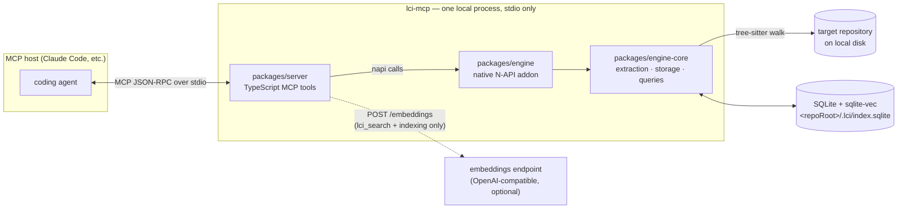
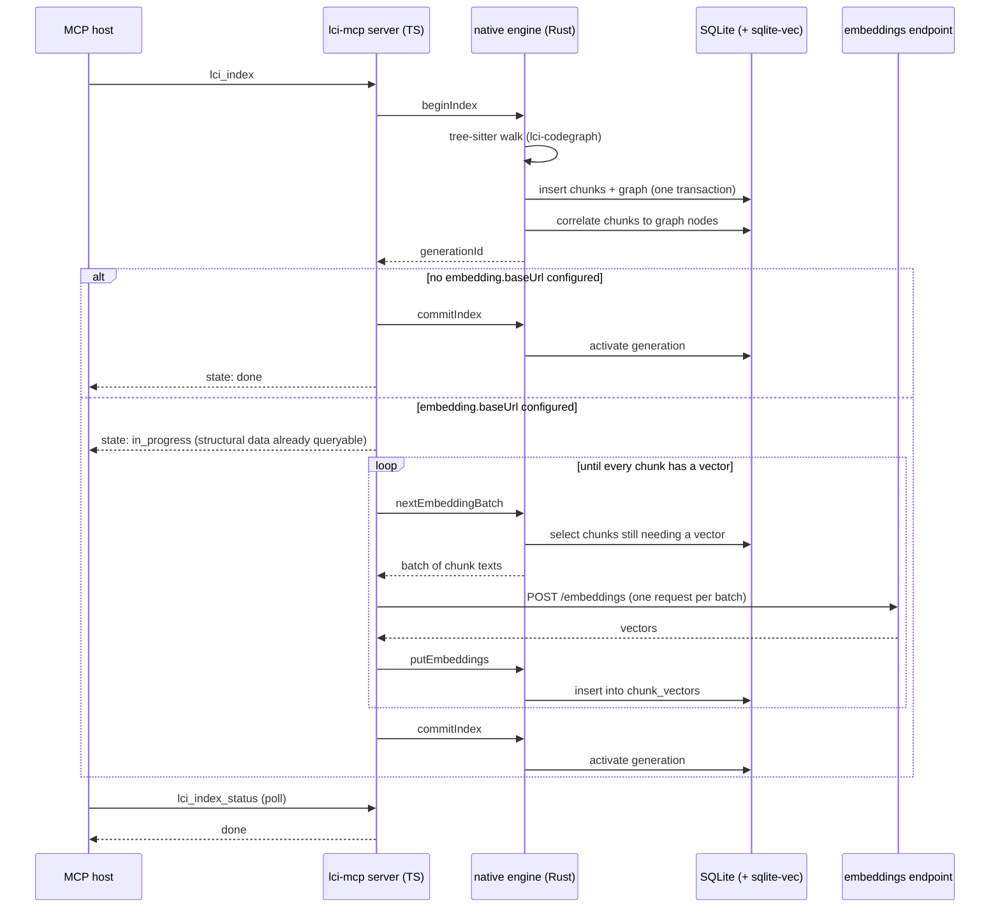

# Lightbridge Code Intelligence — Local MCP

[](https://github.com/ADORSYS-GIS/lci-mcp/actions/workflows/engine.yml)
[](https://github.com/ADORSYS-GIS/lci-mcp/actions/workflows/server.yml)

A local-first [Model Context Protocol](https://modelcontextprotocol.io) server that gives coding
agents repository-aware semantic and structural code retrieval: index a checkout once, then ask it
to find a symbol, walk callers/callees, explore a symbol's neighborhood, or search code by meaning.
No database server to install — everything is a single SQLite file next to the repository.

> **Status:** early — the core index → search → graph-query loop works end to end (see
> [`docs/ARC42.md`](./docs/ARC42.md) for the target architecture and [`docs/adr/`](./docs/adr) for the
> decisions made getting there), but packaging and release automation are not done yet.

---

## How it works

The MCP host launches `lci-mcp` as a local subprocess and talks to it over stdio — there is no
network listener, no server to deploy, and no daemon left running after the host exits. Inside that
one process, the TypeScript server (`packages/server`) calls straight into a native Rust engine
(`packages/engine` / `packages/engine-core`) through N-API; the engine does the actual tree-sitter
parsing and every SQLite read/write. The **only** outbound network call the tool ever makes is to an
optional embeddings endpoint, and only when `lci_search` needs one.



### Indexing flow

`lci_index` runs in two strictly sequential phases, never concurrently: the **whole** repository is
parsed and persisted first, and only once that structural pass fully commits does embedding start,
batch by batch. That's also why the tool call can return before indexing is fully done — structural
data is already queryable the moment it returns, while embeddings (if configured at all) keep
building in the background.



A failed or in-flight reindex never disturbs the previous index — generations only ever swap over
atomically once fully built (`docs/adr/0004-generation-based-indexing.md`).

---

## Quickstart

```bash
npx @vymalo/lightbridge-code-intelligence-mcp --stdio
```

Point an MCP host at that command and it exposes seven tools against the repository it's launched
in: `lci_index`, `lci_index_status`, `lci_search`, `lci_find_symbol`, `lci_get_callers`,
`lci_get_callees`, `lci_explore_symbol`. By default it indexes the current working directory the
host launches it from — pass `--root <path>` to point it at a different directory instead. The
target does not need to be a git repository; a plain directory works, just without commit-aware
staleness checks.

Inspect the resolved configuration for the current repository without starting a server:

```bash
npx @vymalo/lightbridge-code-intelligence-mcp config show
```

### Configuration

Configuration is one object, mergeable from a config file, an `LCI_CONFIG_CONTENT` environment
variable, an inline `--config-json` flag, or CLI flags — see
[`docs/adr/0007-portable-configuration-object.md`](./docs/adr/0007-portable-configuration-object.md).
Semantic search needs an OpenAI-compatible embeddings endpoint:

```json
{
  "embedding": {
    "baseUrl": "https://your-embeddings-endpoint/v1",
    "model": "qwen3-embedding-8b",
    "dimensions": 4096,
    "auth": { "apiKey": "..." }
  }
}
```

Without `embedding.baseUrl` configured, indexing still builds the structural graph — `lci_find_symbol`,
`lci_get_callers`, `lci_get_callees`, and `lci_explore_symbol` all work; only `lci_search` needs
embeddings.

## Repository layout

```text
Cargo.toml         root Cargo workspace — every third-party Rust crate version declared once
packages/
├── engine-core/   pure Rust: extraction orchestration, SQLite/sqlite-vec storage, graph + vector queries
│   └── migrations/  versioned SQL schema files, embedded into the compiled binary at build time
├── engine/        thin napi-rs wrapper exposing engine-core as a native Node addon
└── server/        the MCP server and CLI (TypeScript)
docs/
├── ARC42.md       target architecture
└── adr/           architecture decision records, one per significant decision
```

`engine-core` has no N-API dependency at all, so it's testable with a plain `cargo test` —
including integration tests that index real open-source Rust and Java projects and check the
results against a committed golden graph (`packages/engine-core/tests/`). See
[`docs/adr/0005-separate-core-crate-from-napi-binding-crate.md`](./docs/adr/0005-separate-core-crate-from-napi-binding-crate.md)
for why the split exists.

## Development

Prerequisites: Node ≥ 18, [pnpm](https://pnpm.io), and a Rust toolchain.

```bash
pnpm install
pnpm build          # builds the native addon, then bundles the CLI
pnpm test           # server unit tests
pnpm test:e2e       # spawns the real built CLI and drives it over MCP stdio
pnpm typecheck
pnpm lint           # biome check .
```

Rust tests run independently of the above, across the whole Cargo workspace:

```bash
cargo test --workspace
```

To run the server against a real repository during development, without building first:

```bash
cd packages/engine && pnpm build   # native addon only needs rebuilding after Rust changes
cd packages/server && pnpm dev --root /path/to/some/repo --stdio
```

## Documentation

- [`docs/ARC42.md`](./docs/ARC42.md) — target architecture
- [`docs/adr/`](./docs/adr) — architecture decision records, one per significant decision
